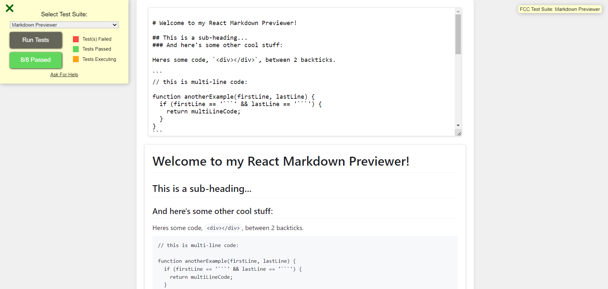

# Markdown Previewer

A simple Markdown Previewer built with React and Vite.



## Demo

You can view a live demo of the Markdown Previewer [here](https://markdown-previewer.hackimtech.com/).

## Features

- Real-time preview of Markdown input.
- Supports GitHub flavored markdown.
- Initial markdown includes examples of various elements.
- Styled using GitHub's markdown CSS.

## Installation

To run this project locally, follow these steps:

1. Clone the repository:

   ```bash
   git clone https://github.com/hackim18/Frontend-Markdown-Previewer
   cd Frontend-Markdown-Previewer
   ```

2. Install dependencies:

   ```bash
   npm install
   ```

3. Start the development server:

   ```bash
   npm run dev
   ```

4. Open your browser and navigate to http://localhost:3000.

## Usage

Type Markdown syntax into the textarea to see it rendered in real-time in the preview area.

## Technologies Used

- React
- Vite
- JavaScript
- HTML/CSS
- Marked library
- GitHub Markdown CSS

## User Stories

1. Display Elements

   - The application has a textarea element with id="editor".
   - The application has a preview element with id="preview".

2. Real-Time Preview

   - As text is entered into the #editor element, the #preview element is updated to display the content of the textarea.

3. Markdown Rendering

   - The application uses the Marked library to render GitHub flavored markdown as HTML in the #preview element.

4. Initial Markdown
   - The initial text in the #editor field contains examples of various markdown elements, including headings, links, inline code, code blocks, list items, blockquotes, images, and bold text.

## Credits

Project inspired by FreeCodeCamp Markdown Previewer project.

## License

This project is licensed under the MIT License - see the LICENSE file for details.
